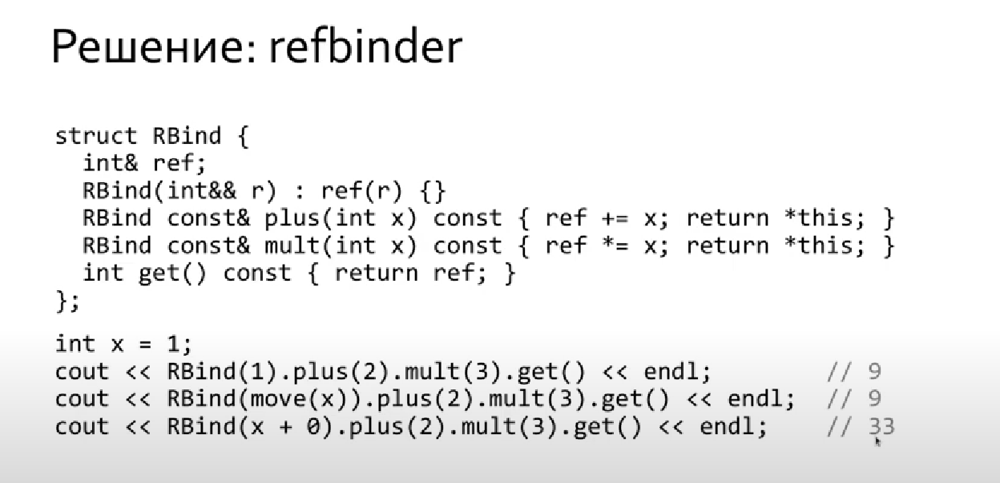
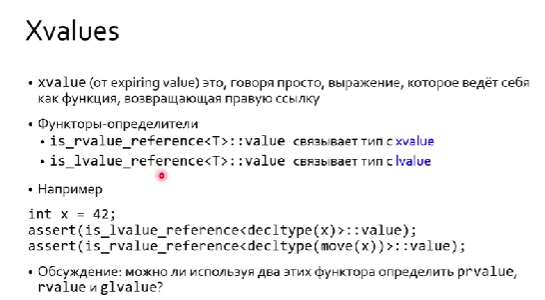
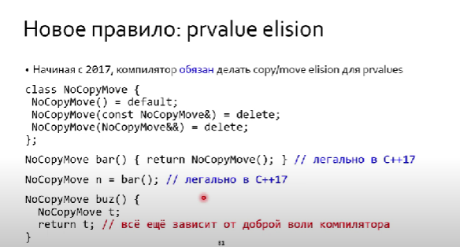

[Lecture 6. Rvalue references, part 1](https://www.youtube.com/watch?v=pjo8iZQWLMY&list=PL3BR09unfgcgJPQZKaacwzGmcXMtEA-19&index=12)

# Что такое lvalue и rvalue

Рассмотрим простой пример:

```c++
int x = 1; // Это попрождает имя для объекта в памяти. У него есть location
int &a = x; // lvalue связывается с location 
int&& b = 3*x; // 3*x - это значение и по сути это временный объект, у него нет своего location, и вот rvalue дает нам этот location. По сути этот механизм продливает время жизни временного объекта в памяти. 
const int& d = 3*x; // Это исключение для lvalue для того что бы давать location для временных объектов. 
```

Нельзя присваивать rvalue lvalue . Это нужно, что бы избежать проблем с выводом типов. 

Но инициализировать lvalue rvalue можно, так как по своей сути rvalue является lvalue

## Провисание ссылок

Провиснуть(dangle) могут все типы ссылок 

```c++
const int& clref(int p) { return p + 0; }// p + 0 is dead

int x = clref(1); // значене x не определено
int сx = clref(1); // значене сx не определено
```


## Refbinder



# На подумать 


По сути конструкторы по умолчанию это плохо потому что может возникнуть double delete 


# Проблемы с move


К сожалению современные компиляторы слишком умные, поэтому дописывают конструктор перемещения даже если его об этом не просили. Это может приводить к большим проблемам. 

Решение это следовать следующему правилу


# Краевой случай применимости 


# Правило объявления implicit методов


# Проблемы при попытке сделать эффективно и решение проблемы


# Свертка ссылок


# Когда использовать std::forward


По сути это perfect forwarding. И он передает идеально rvalue, если значение было таковым, и lvalue, если значение было таковым. 


# Рассмотрим move внутри


# А теперь forward 


Вся идея основанна на reference collapcing. И важно, что управляющий тип это шаблонный параметр, поэтому нам крайне важно указывать тип аргумента (управлящий аргумент) для std::forward. 

Рассмотрим странный пример работы, но он абсолютно легален, если учитывать работу std::froward 


# А может нащ perfect forwardind не особо то и perfect 


И тут мы видим, что perfect forwardind будет таковым с точностью до overloading set. И когда у нас есть стандартные преоьразования и пользовотельские преобразования, то наш механизм дает сбой. 

Вообще проблема с overloading set не решена. И если найдется решение, то это прям неплохо. 


# Категории значений

Это про то какие у нас вообще есть значения. 

Рассмотрим не тривиальную задачу. Довольно интересная:


Хитрое решение это использовать `std::declval`


мы всегда можем сконструировать rvalue даже, если у объекта нет конструктора. 

у всех lvalue можно найти имя и место, точнее имя связано с местом. 
а вот rvalue характеризуется перемещаемостью.  





# Когда мы пишем функцию возвращающую &&


Подобное аннатирование позволает понимать внутри класса над каким объектом класса мы сейчас работаем временным или тем у которого есть идентичность. 

Когда может пригодиться знание о том, с каким объектом работаем. И на самом деле ответ, с любым методом, который возвращает ссылку.


Очевидно, что нам было бы удобно получить compilation error


Пример, когда аннатация методов будет полезна


# Новые правила и улучшения 




# Принцип AAA - almost always auto

Этот принцип гласит - пишите для всех локальных переменных auto


И в С++17 это уже очень хорошо заработало. 


И попытались исправить идиому дополнив ее RR- ref ref


Здесь есть проблема с тем, что мы как бы закладываемся на интерфейс, но пишем а мне впринципе подойдет все что угодно. Это плохо. И это нас подводит к мысли о том, что нам хочется иметь возвращаемый тип, такой что бы он удовлетворял опеределенной цонцепции. И правило для С++20 можно переформулировать как AACRR (almost always concept ref ref)
